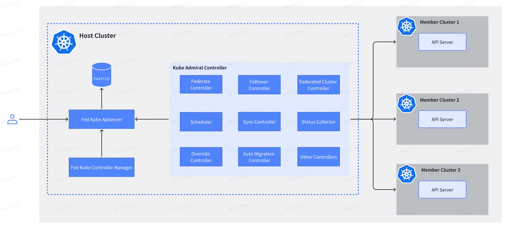

## What is KubeAdmiral

KubeAdmiral is a powerful multi-Kubernetes management engine that is compatible with Kubernetes native APIs, provides rich scheduling policies and an extensible scheduling framework that can help you easily deploy and manage cloud native applications in multi-cloud/hybrid cloud/edge environments without any modification to the application.

## Key Features

- **Unified Management of Multi-Clusters**
  - Support for managing Kubernetes clusters from public cloud providers such as Volcano Engine, Alibaba Cloud, Huawei Cloud, Tencent Cloud, and others.
  - Support for managing Kubernetes clusters from private cloud provider.
  - Support for managing user-built Kubernetes clusters.

- **Multi-Cluster Application Distribution**
  - Compatibility with various types of applications
    - Native Kubernetes resources such as Deployments, StatefulSets, ConfigMaps, etc.
    - Custom Resource Definitions (CRDs) with support for collecting custom status fields and enabling replica mode scheduling.
    - Helm Charts.
  - Cross-cluster scheduling modes
    - Duplicate mode for multi-cluster application distribution.
    - Static weight mode for replica distribution.
    - Dynamic weight mode for replica distribution.
  - Cluster selection strategies
    - Specifying specific member clusters.
    - All member clusters.
    - Cluster selection based on labels.
  - Automatic propagation of dependencies with follower scheduling
    - Built-in follow resources, such as workloads referencing ConfigMaps, Secrets, etc.
    - Specifying follow resources, where workloads can specify follow resources in labels, such as Services, Ingress, etc.
  - Rescheduling strategy configuration
    - Support for enabling/disabling rescheduling.
    - Support configuring rescheduling trigger conditions.
  - Seamless takeover of existing single-cluster resources
  - Overriding member cluster resource configurations with override policy
- **Failover**
  - Manually evict applications in case of cluster failures
  - Automatic migration of applications across clusters in case of application failures
    - Automatic migration of application replicas when they cannot be scheduled.
    - Automatic migration of faulty replicas when they recover.

## Architecture
The overall architecture of KubeAdmiral is shown as below:

The KubeAdmiral control plane runs in the host cluster and consists of the following components:
- Fed ETCD: Stores the KubeAdmiral API objects and federated Kubernetes objects managed by KubeAdmiral.
- Fed Kube Apiserver: A native Kubernetes API Server, the operation entry for federated Kubernetes objects.
- Fed Kube Controller Manager: A native Kubernetes controller, selectively enables specific controllers as needed, such as the namespace controller and garbage collector (GC) controller.
- KubeAdmiral Controller: Provides the core control logic of the entire system. For example, member cluster management, resource scheduling and distribution, fault migration, status aggregation, etc.

The KubeAdmiral Controller consists of a scheduler and various controllers that perform core functionalities. Below are several key components:
- Federated Cluster Controller: Watches the FederatedCluster object and manages the lifecycle of member clusters. Including adding, removing, and collecting status of member clusters.
- Federate Controller: Watches the Kubernetes resources and creates FederatedObject objects for each individual resource.
- Scheduler：Responsible for scheduling resources to member clusters. In the replica scheduling scenario, it will calculate the replicas that each cluster deserves based on various factors.
- Sync Controller: Watches the FederatedObject object and is responsible for distributing federated resources to each member cluster.
- Status Controller: Responsible for collecting the status of resources deployed in member clusters. It retrieves and aggregates the status information of federated resources from each member cluster.

## Concepts

